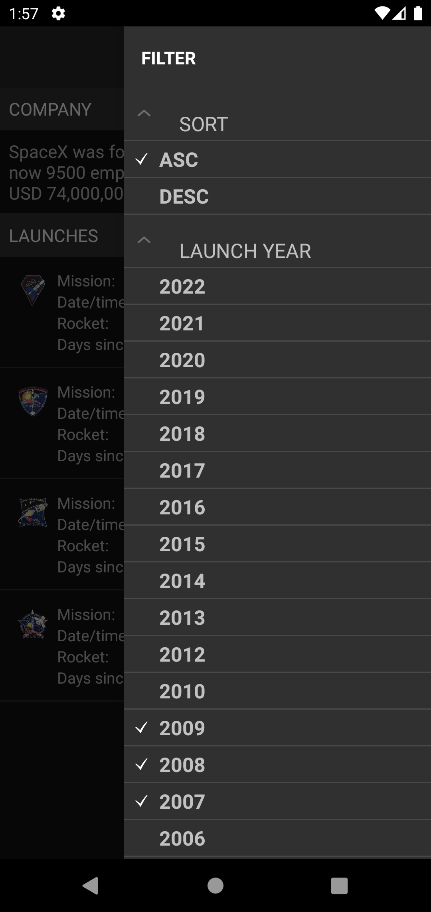
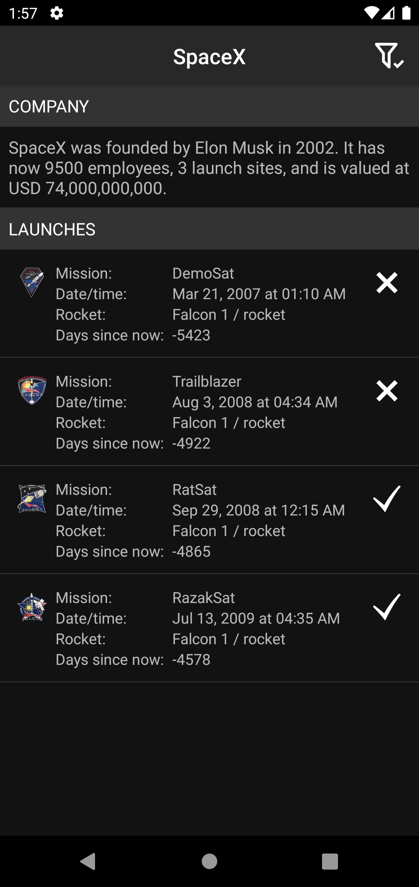
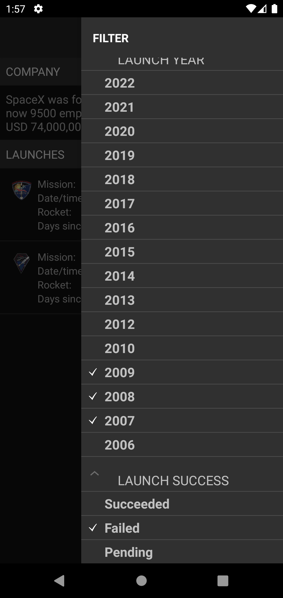
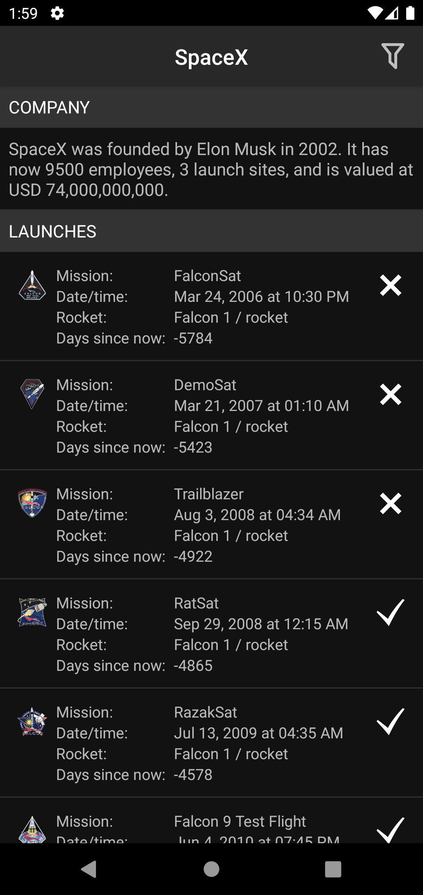
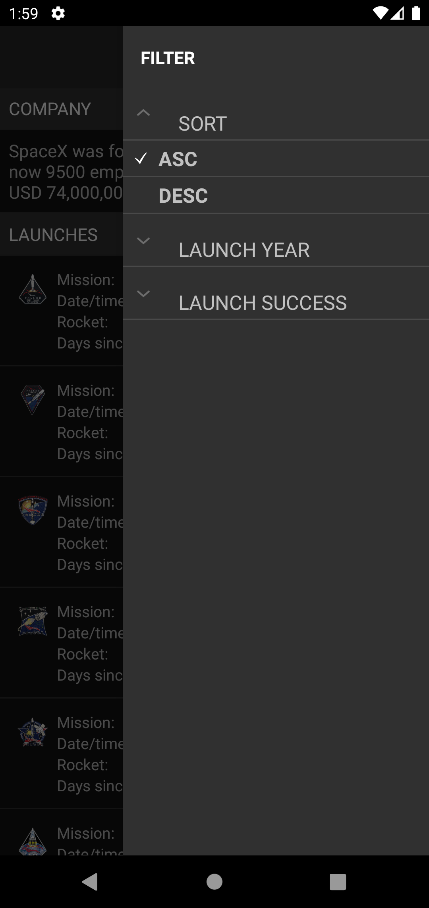
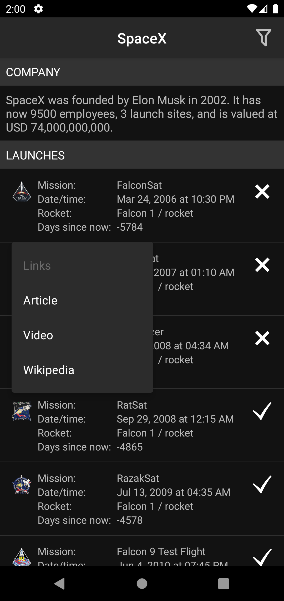
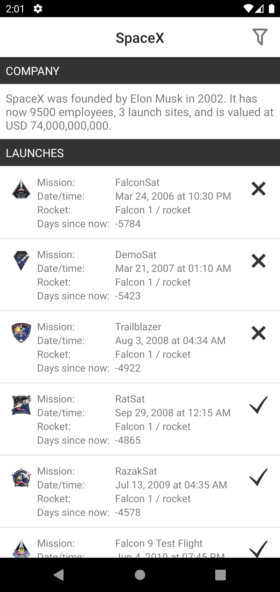
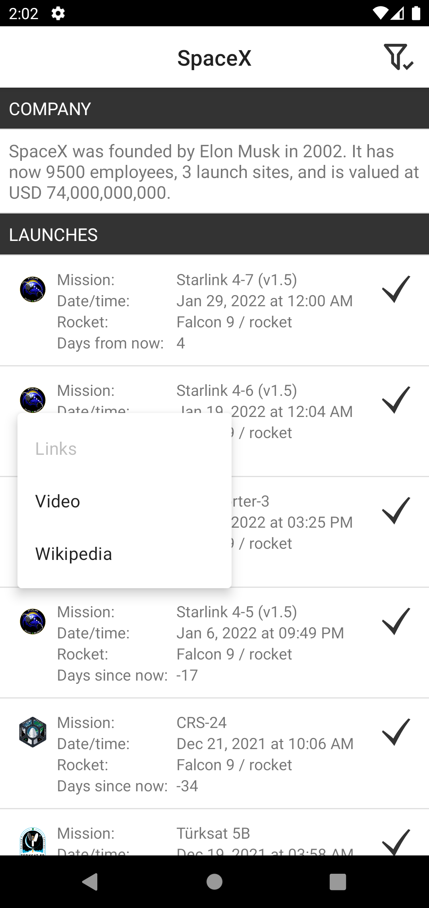
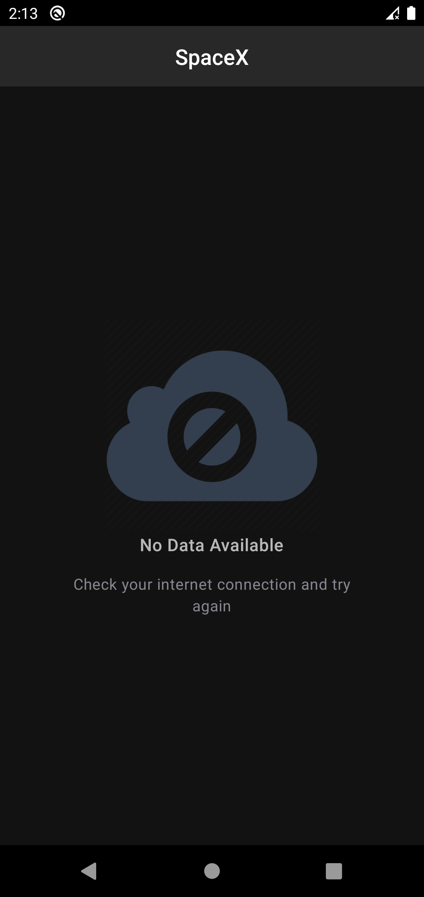

# SpaceX

## **Architecture**

MVI/UDF architecture purely using coroutines. Enough to demonstrate a production quality app focusing on stability, extendability and testability.

 - Hilt 
 - Coroutines 
 - Retrofit     
 - Glide     

 

 

 

 

 
